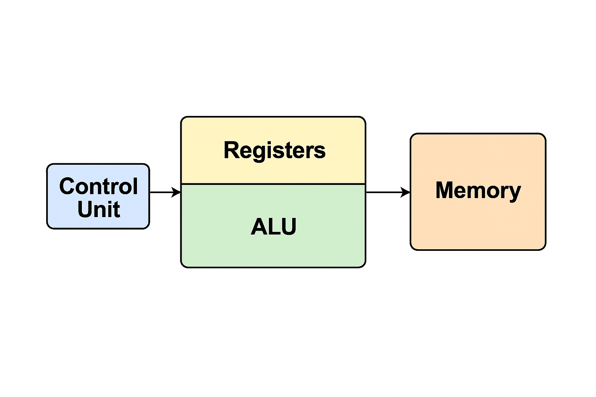

# lab07 - Procesador

## Integrantes
1. [Andres Felipe Diaz Lancheros](https://github.com/felipelan5)
2. [Maykol Estiben valero Hernandez](https://github.com/Maykolelmejor)
3. [Jose Luis Ramos Sepulveda](https://github.com/JOSELRAMOSS)

## Documentación

## Resumen

Este informe documenta el análisis detallado de un Makefile utilizado para la
automatización del flujo de trabajo en el desarrollo de un sistema embebido basado en la
arquitectura PicoSoC con el procesador PicoRV32. El proyecto incluye el uso del software
Quartus para plataformas FPGA como Cyclone IV y MAX10, y proporciona soporte para
simulaciones mediante Verilator. Adicionalmente, se incluye el módulo UART de nombre
simpleuart, que permite la comunicación serie entre el sistema embebido y un terminal.
Se integró un archivo de proyecto Quartus (QSF) proporcionado por la instructora, que sirvió
de base para la implementación.

## Introducción

Los sistemas embebidos han evolucionado hasta permitir la incorporación de
microprocesadores ligeros como PicoRV32 en plataformas FPGA. Para facilitar el
desarrollo, compilación, simulación y programación del sistema, se utilizan Makefiles que
automatizan tareas recurrentes. Este informe describe la estructura del Makefile, sus
funcionalidades, y cómo se vincula con herramientas como Quartus y Verilator. Además, se
analiza el funcionamiento del módulo simpleuart utilizado para comunicaciones seriales.

## Metodología

Se analizó un Makefile que contiene reglas condicionales basadas en la variable TARGET, lo
cual permite configurar el flujo para distintas plataformas FPGA. El Makefile controla la
compilación del firmware en C, la generación de binarios, la conversión a memoria de
programa (progmem.v) y la simulación con Verilator. Se examinó también el módulo UART
escrito en Verilog. Para la implementación en FPGA, se integró un archivo top.qsf
previamente preparado por la instructora.

1. Variables y estructuras del Makefile:

○ SOURCES y SIM_SOURCES: indican los archivos Verilog y de prueba.
○ TARGET: define la plataforma FPGA y ajusta el flujo según sea Cyclone IV,
MAX10, Arty o Nexys.
○ firmware, main.elf, main.lds: automatizan la generación del firmware
con el compilador riscv-none-elf-gcc.
○ sim y waveform: controlan la simulación con Verilator.
○ build, map, fit, asm, program: comandos para usar Quartus cuando
TARGET es compatible (Cyclone IV o MAX10).
○ clean_*: limpian los archivos generados para distintas fases del flujo.

2. Integración de archivo .qsf: El archivo top.qsf especifica las configuraciones
necesarias para el proyecto en Quartus, como la asignación de pines, el dispositivo
FPGA y otros parámetros del flujo de síntesis y colocación.

3. Análisis del módulo simpleuart: Este módulo Verilog gestiona la transmisión y
recepción de datos por UART. Se divide en tres secciones:
○ Configuración del divisor de frecuencia para ajustar la velocidad de baudios.
○ Recepción: detecta el bit de inicio, acumula los bits recibidos y valida los
datos.
○ Transmisión: genera el patrón de bits a enviar según el protocolo UART. El
diseño permite la comunicación eficiente con módulos externos o una PC.

## Reflexión Personal

Este laboratorio fue muy valioso ya que permitió reforzar los conocimientos adquiridos en las prácticas anteriores. En especial, me ayudó a comprender cómo cada módulo que construimos anteriormente (como la ALU y el banco de registros) cobra significado al integrarse para crear un procesador que funcione. 
Uno de los aprendizajes más significativos fue entender cómo se expresa una instrucción y cómo la unidad de control tiene la tarea de interpretarla y enviar las señales apropiadas. Al principio, esto parecía complicado, pero al dividirlo en partes más simples, todo comenzó a aclararse. 

Otro aspecto fundamental fue el reconocimiento de que el procesador opera de forma cíclica, procesando una instrucción por cada ciclo de reloj y avanzando gradualmente con el contador de programa. 

## Conclusión

El Makefile analizado proporciona una solución integral para automatizar todas las fases del
desarrollo de un sistema embebido con PicoSoC, desde la compilación del firmware hasta la
programación del dispositivo FPGA. La flexibilidad para adaptarse a diferentes plataformas
y el uso de herramientas como Quartus y Verilator lo convierten en un recurso educativo y
profesional robusto. La adición del archivo .qsf facilitado por la instructora permitió una
implementación más eficiente en la plataforma deseada. Finalmente, el módulo
simpleuart garantiza la conectividad serial, esencial para la depuración y el monitoreo del
sistema.

## Evidencias
[archivo .v](/arqprogmem.v)